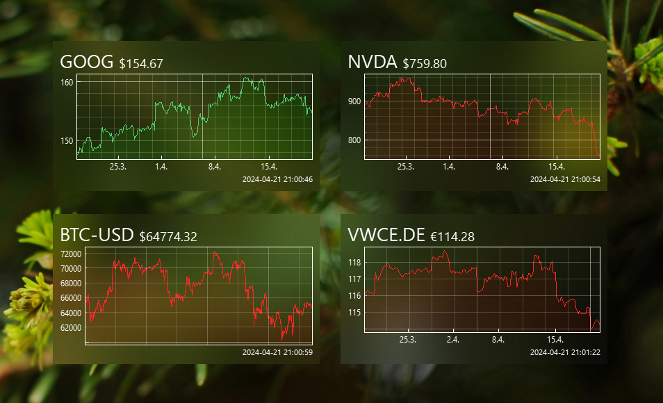
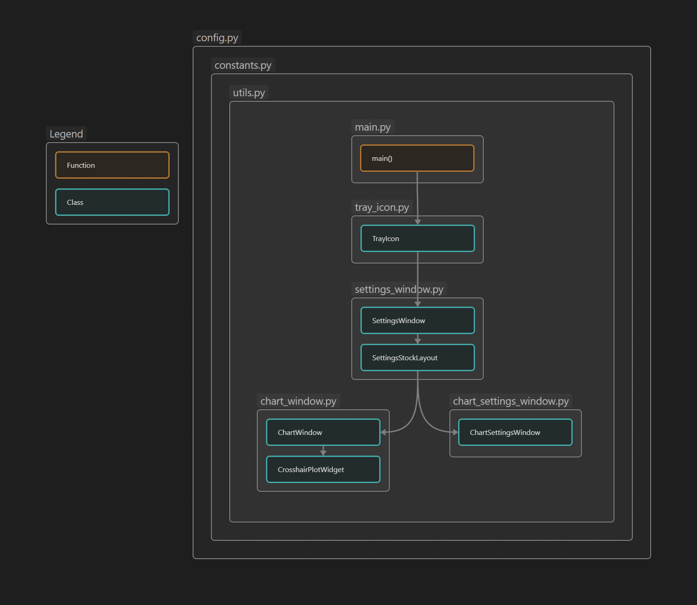

# desktop-widget

desktop-widget is a stock chart widget app for the desktop.

- data from [yahoo finance](https://finance.yahoo.com/) ([yfinance](https://github.com/ranaroussi/yfinance)) - support for stocks / etfs / crypto / ...
- automatic startup with windows
- "bought-at" price on chart
- blurred background
- fast rendering using [pyqtgraph](https://github.com/pyqtgraph/pyqtgraph)
- 1 month timeframe
- daily percentage change
- tray icon for settings



## Development

- create venv `python3 -m venv venv`
- activate venv (windows) `venv\Scripts\activate`
- activate venv (linux/macos) `source venv/bin/activate`
- install requirements `pip install -r requirements.txt` or `python3 -m pip install -r requirements.txt`
- run app with: `python main.py`

### Libraries

- PyQt6
- pyqtgraph
- yfinance
- numpy
- pandas
- BlurWindow

### Class Overview



## Building

### Windows build .exe

`pyinstaller src/main.py --onefile --noconsole --paths=./venv/lib/site-packages --name=StockWidget --icon=src/assets/icon.png --add-data "src/assets:assets"`

#### then rebuild with

`pyinstaller StockWidget.spec`

#### Auto Launch on System Start

Autostart adds windows registry key to

`Computer\HKEY_CURRENT_USER\Software\Microsoft\Windows\CurrentVersion\Run`

if running as .exe

### MacOS build x86/arm/universal2

`pyinstaller main.py --onefile --noconsole --paths=./venv/lib/python3.12/site-packages --name=StockWidget --icon=icon.png --add-data "icon.png:." --add-data "locked.png:." --add-data "unlocked.png:."`

for arm and x86 (probably need to build universal2 wheels first (below)):

`pyinstaller main.py --onefile --noconsole --paths=./venv/lib/python3.12/site-packages --name=StockWidget --icon=icon.png --add-data "icon.png:." --add-data "locked.png:." --add-data "unlocked.png:." --target-arch=universal2`

#### test builds

`pyinstaller blur_macos_ns.py --onefile --noconsole --paths=./venv/lib/python3.12/site-packages --name=blur_macos_ns --icon=icon.png --add-data "icon.png:." --target-arch=universal2`

`pyinstaller blur_macos_lib.py --onefile --noconsole --paths=./venv/lib/python3.12/site-packages --name=blur_macos_lib --icon=icon.png --add-data "icon.png:." --target-arch=universal2`

`pyinstaller blur_macos_lib.py --onefile --noconsole --paths=./venv/lib/python3.12/site-packages --name=blur_macos_lib --icon=icon.png --add-data "icon.png:."`

`pyinstaller blur_macos_ns.py --onefile --noconsole --paths=./venv/lib/python3.12/site-packages --name=blur_macos_ns --icon=icon.png --add-data "icon.png:."`

not working because numpy does not provide universal2 wheels:

`python3.12 -m pip install numpy --platform=universal2 --target=venv/lib/python3.12/site-packages/ --no-deps --upgrade`

`python3.11 -m pip install numpy --platform=universal2 --target=venv/lib/python3.11/site-packages/ --no-deps --upgrade`

build own universal2 numpy wheel:

```bash

pip install delocate
wget https://files.pythonhosted.org/packages/94/9c/f1e88764737c126637d0434df712b1baa371a404a3e3751ee997e74e164b/numpy-1.26.3-cp312-cp312-macosx_11_0_arm64.whl
wget https://files.pythonhosted.org/packages/6d/66/5ea5b8ef7cb3f72ecd6c905abc2331f999bf7e9de247f9db8cc9642f0eda/numpy-1.26.3-cp312-cp312-macosx_10_9_x86_64.whl
delocate-fuse numpy-1.26.3-cp312-cp312-macosx_10_9_x86_64.whl numpy-1.26.3-cp312-cp312-macosx_11_0_arm64.whl -w .

--> numpy-1.26.3-cp312-cp312-macosx_10_9_x86_64.whl is fused wheel

pip install numpy-1.26.3-cp312-cp312-macosx_10_9_x86_64.whl --force-reinstall

build own universal2 pandas wheel:

pip install delocate
wget https://files.pythonhosted.org/packages/72/33/e873f8bdeac9a954f93f33fb6fbdf3ded68e0096b154008855616559c64c/pandas-2.2.0-cp312-cp312-macosx_11_0_arm64.whl
wget https://files.pythonhosted.org/packages/e1/1e/d708cda584a2d70e6d3c930d102d07ee3d65bec3b2861f416b086cc518a8/pandas-2.2.0-cp312-cp312-macosx_10_9_x86_64.whl
delocate-fuse pandas-2.2.0-cp312-cp312-macosx_10_9_x86_64.whl pandas-2.2.0-cp312-cp312-macosx_11_0_arm64.whl -w .

--> pandas-2.2.0-cp312-cp312-macosx_10_9_x86_64.whl is fused wheel

pip install pandas-2.2.0-cp312-cp312-macosx_10_9_x86_64.whl --force-reinstall

--> PANDAS REINSTALLS NUMPY SO NEED TO INSTALL THAT FUSED WHEEL AGAIN
build own universal2 PyQt6-Qt6 wheel:

pip install delocate
wget https://files.pythonhosted.org/packages/b6/bf/94ce06e5f2e36a6ea7ead39fa63db6b1cc91e2aa51768e7fdcd296d0d2b0/PyQt6_Qt6-6.6.1-py3-none-macosx_11_0_arm64.whl &&
wget https://files.pythonhosted.org/packages/0a/01/70d5341b9b26104bf31bb52704bcce7bee367991151a3754e4b5faefd248/PyQt6_Qt6-6.6.1-py3-none-macosx_10_14_x86_64.whl
mkdir pyqt6
delocate-fuse PyQt6_Qt6-6.6.1-py3-none-macosx_10_14_x86_64.whl PyQt6_Qt6-6.6.1-py3-none-macosx_11_0_arm64.whl -w pyqt6

--> results in arm64 (universal2 not currently working for this lib)

delocate-fuse PyQt6_Qt6-6.6.1-py3-none-macosx_11_0_arm64.whl PyQt6_Qt6-6.6.1-py3-none-macosx_10_14_x86_64.whl -w pyqt6

--> results in x86_64 (universal2 not currently working for this lib)
check if if worked: 

file Qt6/lib/QtCore.framework/Versions/A/QtCore

--> PyQt6_Qt6-6.6.1-py3-none-macosx_10_14_x86_64.whl is fused wheel

pip install PyQt6_Qt6-6.6.1-py3-none-macosx_10_14_x86_64.whl --force-reinstall

```

remove from quarantine:
`xattr -d com.apple.quarantine /Applications/StockWidget.app`
